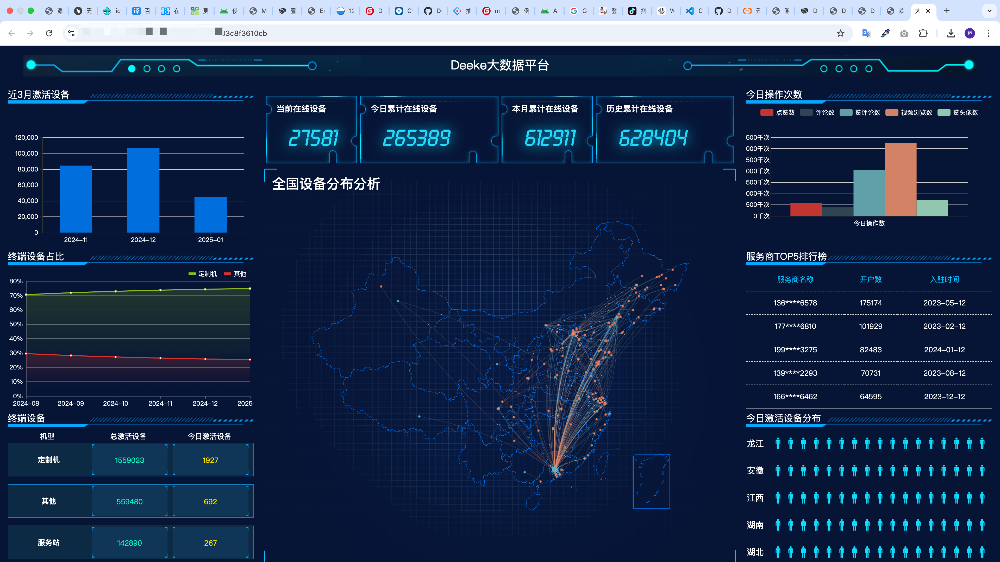

# 管理后台支持

DeekeScript给企业用户提供了后台管理系统支持，可以轻松管理App的激活码，开通代理商等。

## 功能说明
* 系统管理员登录
* 代理商登录
* 创建代理商（通过分配点数控制代理商创建卡密）
* 代理商创建卡密（可以创建1天、3天、7天、30天、3月、6月、1年、2年使用期限的卡密）
* AI角色配置
* AI角色秘钥配置
* APP后台更新
* 开屏广告图片设置、支付广告图片设置
* 数据大屏

## 界面

