# 表单示例

## 基本介绍

当前在DeekeScript框架开发中，form表单是通过deekeScript.json文件来配置的，采用Android内置的Preference Framework。表单主要有以下几种类型，分别是：text、textArea、select、checkboxGroup、checkbox、radio、switch、number、numberRange、digitRange、digit、notice

> 各个参数类型，请严格按照示例中填写，否则可以导致APP闪退。

> deekeScript.json中表单的值采用下面的方式获取：

```javascript
//不同类型需要不同的方式获取，具体请参与“本地存储-Storage”章节
Storage.get('task_name');
Storage.getInteger("number_1");//输出：33
Storage.getBoolean("switch_1");//输出：true
Storage.getArray("select_1");//输出：[1,2,3]
```

## 📝 text

> **notice**: 输入框说明信息，非必须
> **hidden**: 非必须，表示是否隐藏，默认false

```json
{
    "type": "text",
    "label": "输入任务名称",
    "name": "task_name",
    "value": "23432",
    "notice": "* 任务名称不能为空"
}
```
> 显示效果

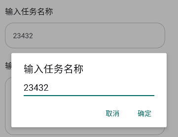


## 📝 textarea

> **notice**: 输入框说明信息，非必须
> **hidden**: 非必须，表示是否隐藏，默认false
> **lines**: 非必须，表示多少行（默认1行）

```json
{
    "type": "textArea",
    "label": "输入任务名称",
    "name": "text_2",
    "lines": 5,
    "value": "23432",
    "notice": "* 任务名称不能为空"
}
```
> 显示效果

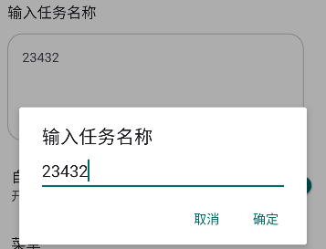


## 📝 password

> **notice**: 输入框说明信息，非必须
> **hidden**: 非必须，表示是否隐藏，默认false

```json
{
    "type": "password",
    "label": "密码",
    "name": "task_password",
    "value": "",
    "notice": "* 密码不能为空"
}
```
> 显示效果


## 📝 switch

> **hidden**: 非必须，表示是否隐藏，默认false

```json
{
    "type": "switch",
    "label": "自动运行",
    "name": "switch_1",
    "value": true
}
```
> 显示效果


## 📝 select

> **hidden**: 非必须，表示是否隐藏，默认false

```json
{
    "type": "select",
    "label": "菜单",
    "name": "select_1",
    "options": [{
        "label": "小猫",
        "value": "1",
        "selected": true
    },
    {
        "label": "小狗",
        "value": "2"
    }]
}
```
> 显示效果

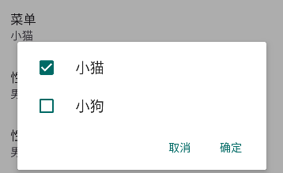


## 📝 radio

> **hidden**: 非必须，表示是否隐藏，默认false

```json
{
    "type": "radio",
    "label": "性别",
    "name": "radio_1",
    "value": "1",
    "options": [{
        "label": "男",
        "value": "1",
    },
    {
        "label": "女",
        "value": "2"
    }]
}
```
> 显示效果

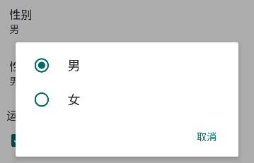


## 📝 checkbox

> **hidden**: 非必须，表示是否隐藏，默认false

```json
{
    "type": "checkbox",
    "label": "性别",
    "name": "checkbox_1",
    "options": [{
        "label": "男",
        "value": "1",
        "selected": true
    },
    {
        "label": "女",
        "value": "2"
    }]
}
```
> 显示效果

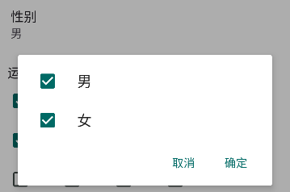


## 📝 checkboxGroup

> **hidden**: 非必须，表示是否隐藏，默认false

```json
{
    "type": "checkboxGroup",
    "label": "运行时间",
    "name": "checkboxGroup",
    "children": [
        "00时",
        "01时",
        "02时",
        "03时",
        "04时",
        "05时",
        "06时",
        "07时",
        "08时",
        "09时",
        "10时",
        "11时",
        "12时",
    ],
    "values": [
        "0",
        "1",
        "3",
        "5"
    ]
}
```
> 显示效果

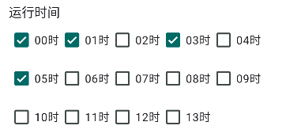


## 📝 digitRange或者numberRange

> **hidden**: 非必须，表示是否隐藏，默认false
> **min**: 最小值，非必须，默认0
> **max**: 最大值，非必须，默认100
> **step**: 步长，非必须，默认1

```json
{
    "type": "numberRange",
    "label": "年龄",
    "name": "numberRange_1",
    "min": 0,
    "max": 100,
    "step": 1,
    "value": 33
}
```
> 显示效果

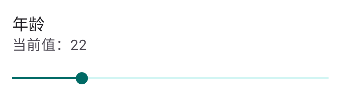

## 📝 digit或者number

> **hidden**: 非必须，表示是否隐藏，默认false

```json
{
    "type": "number",
    "label": "执行时间",
    "name": "number_1",
    "value": 33
}
```
> 显示效果

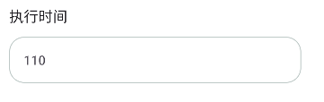


## 📝 file

> **hidden**: 非必须，表示是否隐藏，默认false

```json
{
    "type": "file",
    "label": "文件地址",
    "name": "task_file"
}
```
> 显示效果

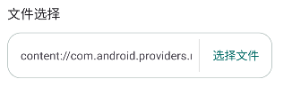


## 📝 datePicker

> **hidden**: 非必须，表示是否隐藏，默认false

```json
{
    "type": "datePicker",
    "label": "日期",
    "name": "task_date"
}
```
> 显示效果

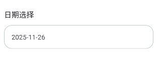


## 📝 timePicker

> **hidden**: 非必须，表示是否隐藏，默认false

```json
{
    "type": "timePicker",
    "label": "日期",
    "name": "task_time"
}
```
> 显示效果

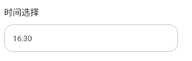


## 📝 notice

> **hidden**: 非必须，表示是否隐藏，默认false

```json
{
    "type": "notice",
    "title": "* 注意，本功能必须开启图色查找权限"
}
```
> 显示效果


## 📝 divider

> **hidden**: 非必须，表示是否隐藏，默认false

```json
{
    "type": "divider",
    "label": "分割线"
}
```
> 显示效果


# 表单动态值

> 有时候你希望通过接口来初始化表单的值，而不是直接固定值（目前仅支持radio表单）

## radio默认值
```
{
    "type": "radio",
    "label": "请选择角色",
    "name": "role",
    "options": [],
    "dataFrom": "role"
}
```

> 需要[config接口](../../backendApi/activationCode.md#配置接口)的data字段中包含role字段，并且role的值必须包含options需要的字段（label和value）

> 属性类型说明请参考[deekeScript.json文件](../../config/config.md)
