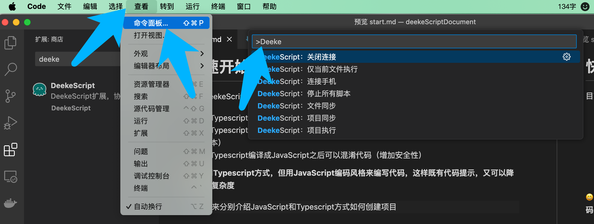
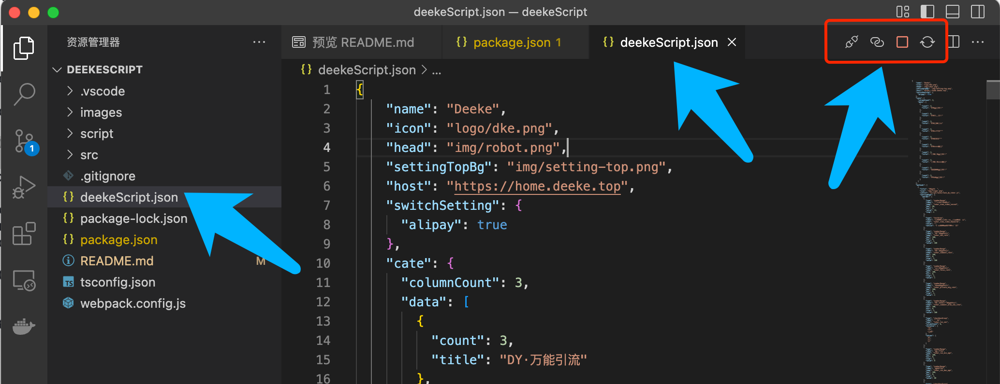
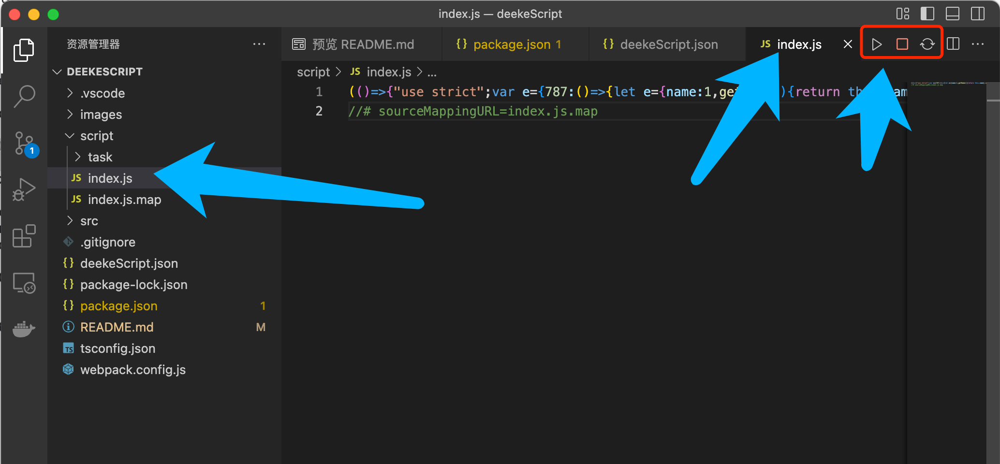
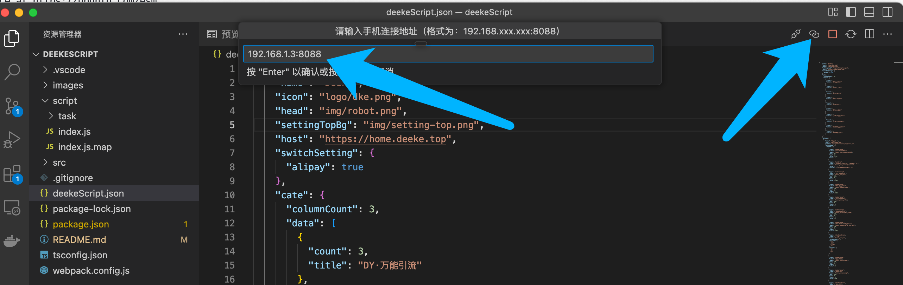
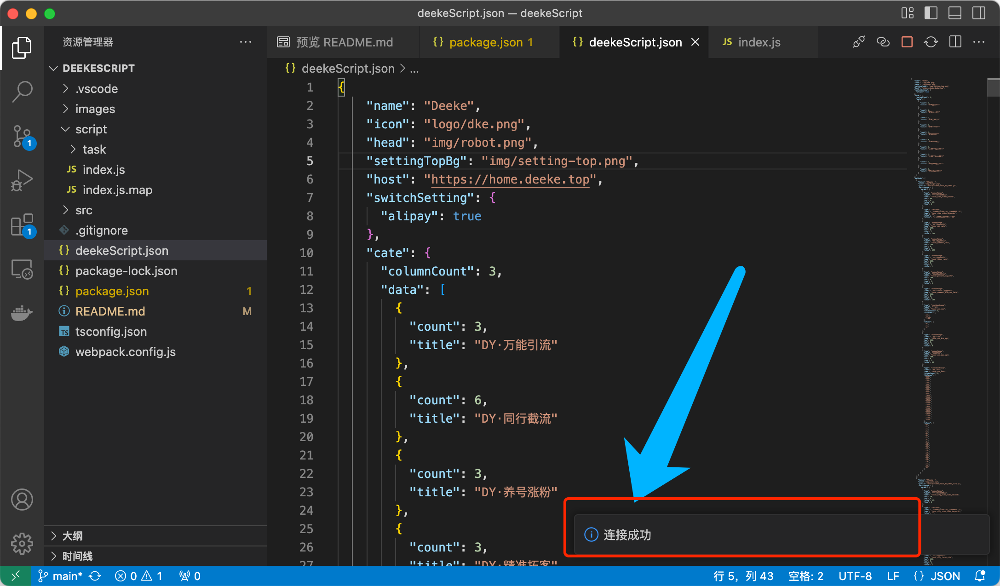
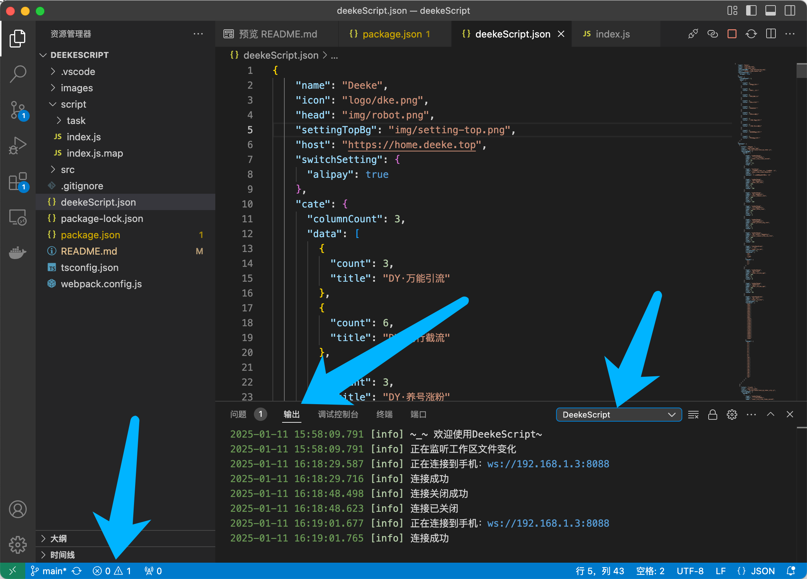
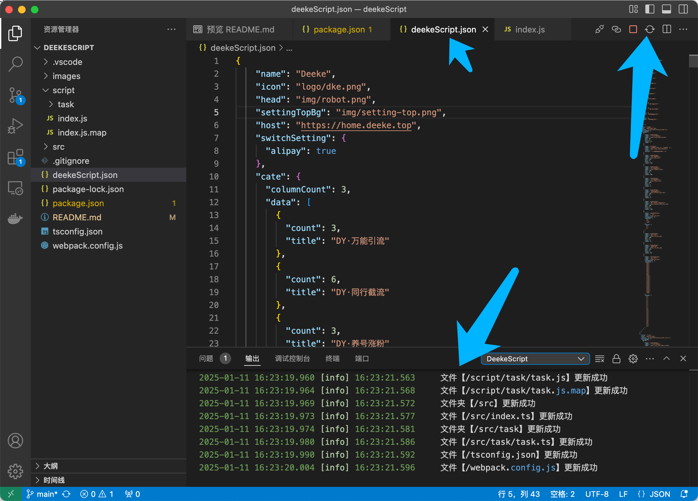
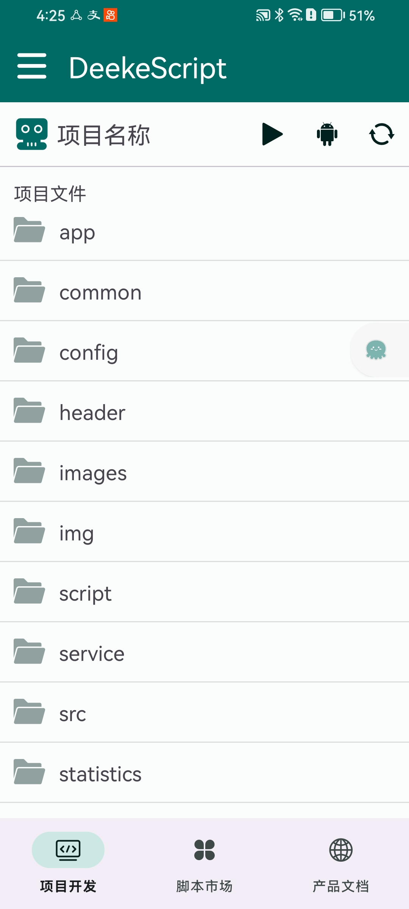
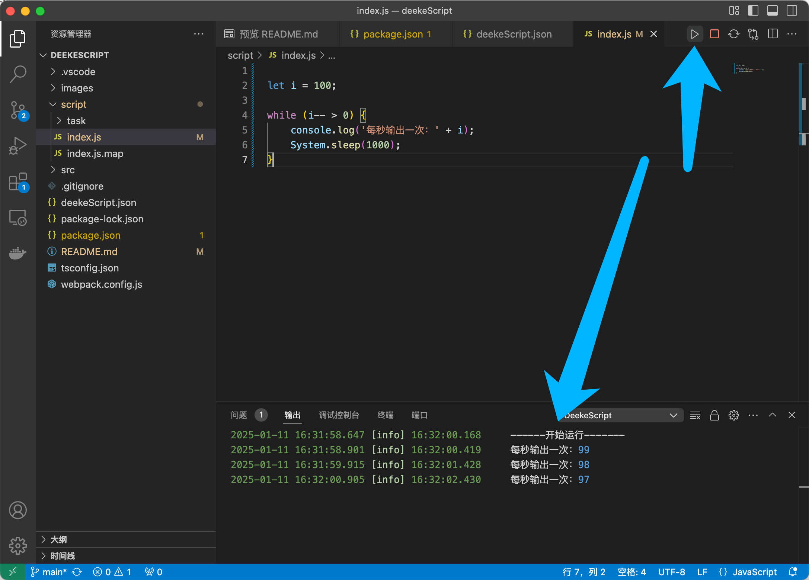
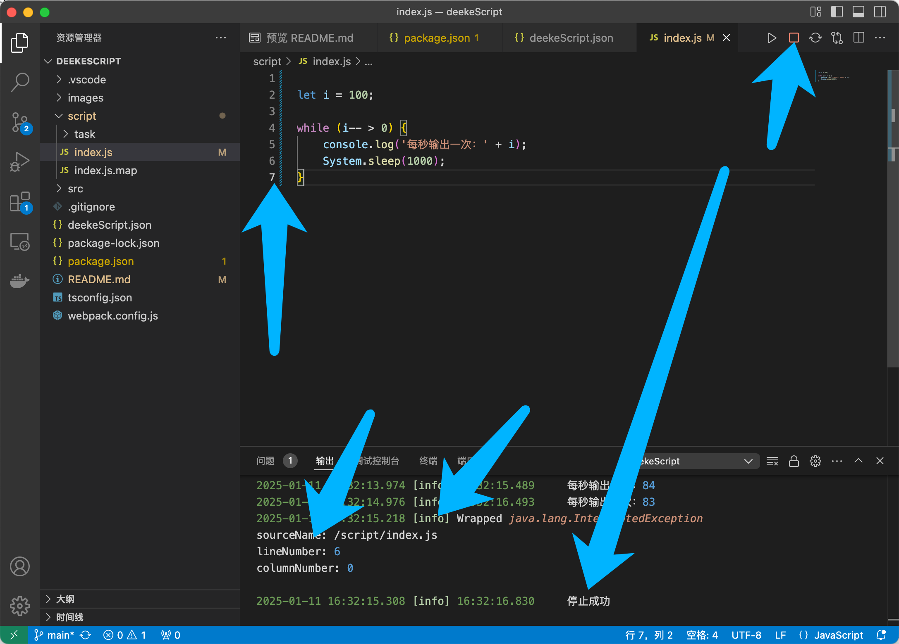

# VSCode开发篇

## 准备工作
* 如果电脑还没有安装vscode，请先[下载vscode](https://code.visualstudio.com/)
* 在Vscode中安装DeekeScript开发插件，如下图，点击“安装”即可
 

* 如果你还没有下载项目代码，请先阅读[快速开始](../quick/start.md)

## Vscode扩展使用

**vscode中执行DeekeScript命令有两种方式：**
> 方法1：通过“查看”-“命令面板”-“搜索命令”-“点击命令执行”，如下图：

  

> 方法2：打开deekeScript.json文件或者任意js文件，通过右上角图标执行，如下图：

  

  

> 下面以方法2来演示vscode连接、关闭连接、代码同步、文件同步、文件执行

* 连接手机：点击“连接手机”按钮，在弹窗中输入手机端的局域网IP地址，看到“连接成功”即表示连接成功：
  

  

* 打开DeekeScript控制台（可以查看相关信息，包括脚本打印信息），如下图：
  

* 项目同步：点击“项目同步”按钮，如下图：
  

* Android端点击“刷新”按钮（安卓图标右侧的按钮）

  

* Android端点击“运行”按钮（安卓图标左侧按钮），运行结果如下图：

  

* 执行单个JavaScript文件，如下图：
  

* 停止所有脚本（包括死循环脚本），如下图：

  

## 命令说明：
* DeekeScript 关闭连接：关闭vscode和Android手机的连接
* DeekeScript 连接手机：vscode连接手机（连接后才能“同步代码”、“执行代码”）
* DeekeScript 停止所有脚本：关闭DeekeScript在Android手机上的所有脚本运行
* DeekeScript 项目同步：将vscode中的项目代码同步到Android手机端
* DeekeScript 仅当前文件执行：执行当前JavaScript文件的脚本
* DeekeScript 文件同步：仅同步当前文件到Android手机