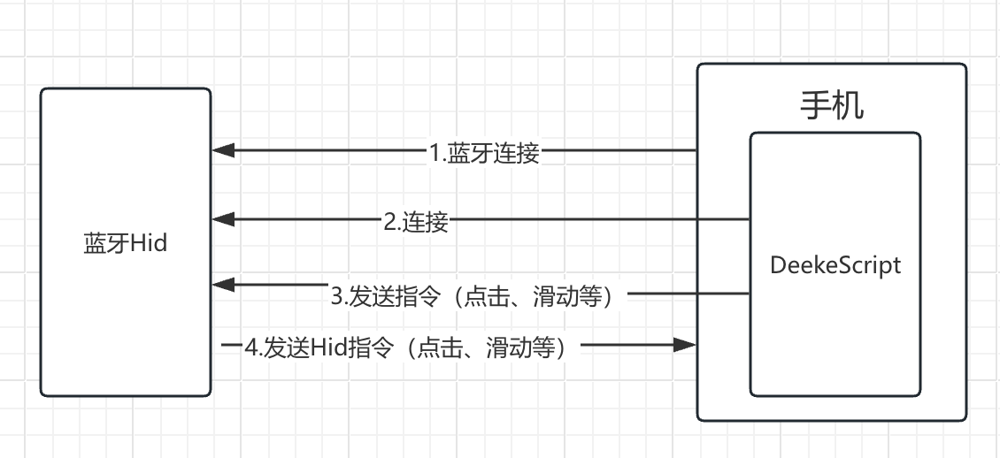

# 蓝牙Hid硬件介绍

## 硬件介绍

当前市面上上的Hid硬件主要有两种方式，一种是通过蓝牙连接，一种是通过USB连接。当前DeekeScript选择的是蓝牙Hid硬件。

### 原理图

### 工作流程

> 1.手机打开蓝牙连接蓝牙Hid设备
>
> 2.DeekeScript连接蓝牙
>
> 3.DeekeScript发送指令到蓝牙Hid设备
>
> 4.蓝牙Hid设备接受到DeekeScript指令后，将对应指令通过蓝牙Hid发送到手机
>
> 5.手机接收到蓝牙Hid设备发送的指令后，执行对应的操作（点击、滑动、输入等）
