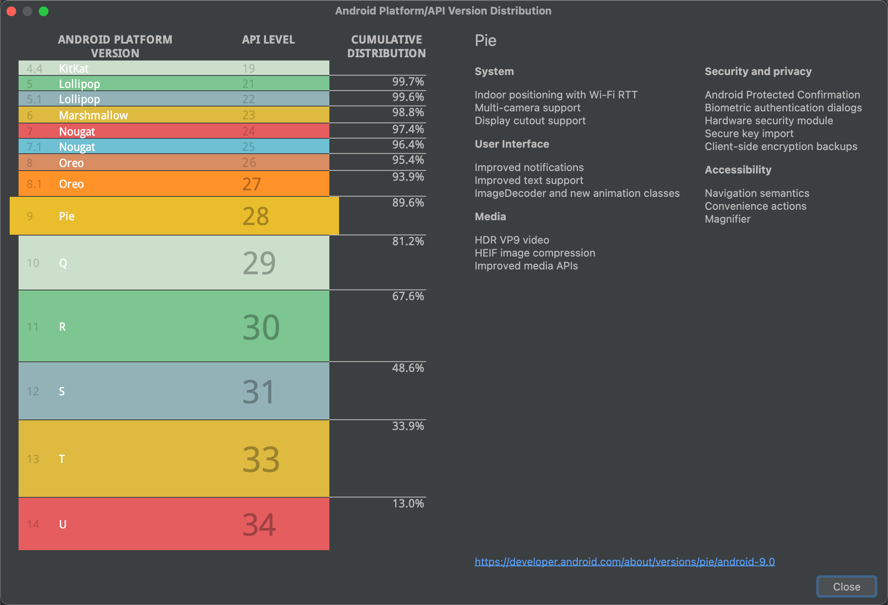

# 开发环境说明

### Android版本支持

DeekeScript对绝大多数Android版本都提供支持，主要支持Android 8.0及以上版本（截止目前>95.4%）；对应的Android Api版本是26及以上。下图是截止日期（2025-01-10）Android的版本占比分布情况。

### Android权限说明
使用DeekeScript可以获取Android的哪些权限呢？ 目前DeekeScript不限制应用获取Android权限，只要Android开放的权限，DeekeScript都会开放。当前功能运行默认需要启动“无障碍”、“悬浮窗”权限。

### JavaScript支持哪些能力？

DeekeScript底层是基于[Rhino引擎（1.8版本）](https://rhino.github.io/tutorials/embedding_tutorial/)，Rhino是由Java开发的JavaScript引擎，因此它对JavaScript调用Java天生就很友好，后续DeekeScript也将逐步开放越来越多的Java对象提供给JavaScript使用。

> 如果你需要了解Rhino对es5和es6支持情况，请访问：https://mozilla.github.io/rhino/compat/engines.html

### 基础函数支持
很多开发者之前可能了解浏览器环境下的JavaScript，因此可能习惯了使用setTimeout、setInterval、console.log等方法，这些DeekeScript也都是支持的。

### 是否支持模块化
DeekeScript本身就是为了支持项目化（针对某个或者某些应用开发N个脚本）开发的工具（而不仅仅只是支持单个脚本的开发），所以对模块化支持也是很友好的，具体可以参阅<a href="../advance/module.md">模块化</a>

### 异步支持
DeekeScript提供了异步支持，具体参考<a href="../promise/awa.md">DeekeScript异步</a>

### 是否支持多线程？
相信富有经验的开发者，会发现很多工具都有提供多线程支持；因为很多时候，我们需要同时执行两个操作（比如，采集直播间弹幕的时候，又要实时获取在线人数）；这个时候使用多线程的方式可以更好地满足我们的需求。DeekeScript本身也是支持多线程的；因为JavaScript是不支持多线程的，实际上底层是由Java在执行，具体可以参考<a href="../advance/thread.md">多线程篇</a>。

### 其他支持

- [Http](../base/http/http.md)支持
- [Websocket](../base/webSocket/webSocket.md)支持
