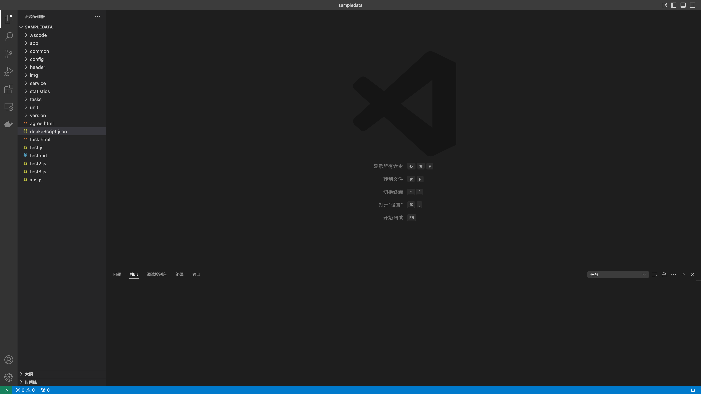

# 快速开始

目前DeekeScript支持JavaScript和Typescript开发（推荐）。

- Typescript方式支持DeekeScript代码提示（提升编写速度）
- Typescript有着更加严格的类型控制（降低代码错误，增加代码可读性，降低代码维护成本）
- Typescript编译成JavaScript之后可以混淆代码（增加安全性）

**😄 使用Typescript方式，但用JavaScript编码风格来编写代码，这样既有代码提示，又可以降低代码复杂度**

> 接下来分别介绍JavaScript和Typescript方式如何创建项目

## 准备工作
* [下载vscode](https://code.visualstudio.com/)
* 在Vscode中安装DeekeScript开发插件，如下图，点击“安装”即可
 

* 在手机上[下载安装DeekeScript软件包](../assets/deekeScript_v1.00.01-release.apk)
* 打开DeekeScript的侧边栏（左上角“三条杠”），开启“无障碍”、“悬浮窗”、“开启服务”

## 控件查看器
> 节点查看器主要用于查看手机界面上的“控件”信息，使用节点信息来查找你需要的“控件”，然后对控件进行点击或者输入以及滑动等操作

- 打开手机端的DeekeScript，如下图，可以看到手机的局域网IP是“192.168.1.3”：

  

- 打开浏览器，输入："http://192.168.1.3:8080"，可以看到下面的页面
  

- 选择左侧的控件，点击之后，就可以清楚地看到控件信息了

> 如果你需要看到更多的控件，可以选择“复杂模式”；有时候你可能不想打开vscode调试，你可以切换到“在线调试”进行功能调试

## 创建JavaScript项目

- 通过git获取基础代码
  ```
   git clone https://github.com/DeekeScript/deekeScriptDemo.git ./
  ```

- 打开Vscode代码编辑器，并且将刚刚克隆的项目打开，如下图：

  
  
- [同步项目到手机](../config/vscode.md)，让APP启动
- 手机中的APP已经出现了相应的界面，可以在手机中点击对应的功能进行运行，大概如下图：

  


## 创建TypeScript项目

- 通过git获取基础代码
  ```
  git clone https://github.com/DeekeScript/DeekeScript ./
  ```

- 打开Vscode代码编辑器，并且将刚刚克隆的项目打开，如下图：


- 在当前文件夹下执行：
  ```
  # 如果电脑没有安装nodejs，还需要安装nodejs
  # 如果执行下面的代码卡顿，注意将npm镜像设置为阿里云镜像
  npm install
  ```

- 编写Typescript代码
- 编译Typescript代码，如下图：

  
- [同步项目到手机](../config/vscode.md)，让APP启动

- 手机中的APP已经出现了相应的界面，可以在手机中点击对应的功能进行运行，大概如下图：

  


## 单个JavaScript或者Typescript调试
> 我不想创建项目，只想创建一个js或者ts文件，直接运行可以么？
这样是可以的，目前DeekeScript只支持项目运行，vscode可以调试单个文件，操作如下：

- 创建一个js文件，如：test.js
- 点击右上角的“执行”图标即可

> 如果是Typescript，则需要先执行编译动作，然后再进入项目的script文件夹下面的对应js文件下，执行上面的操作即可！
