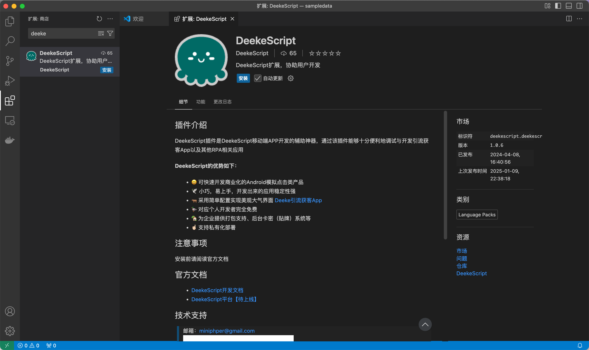
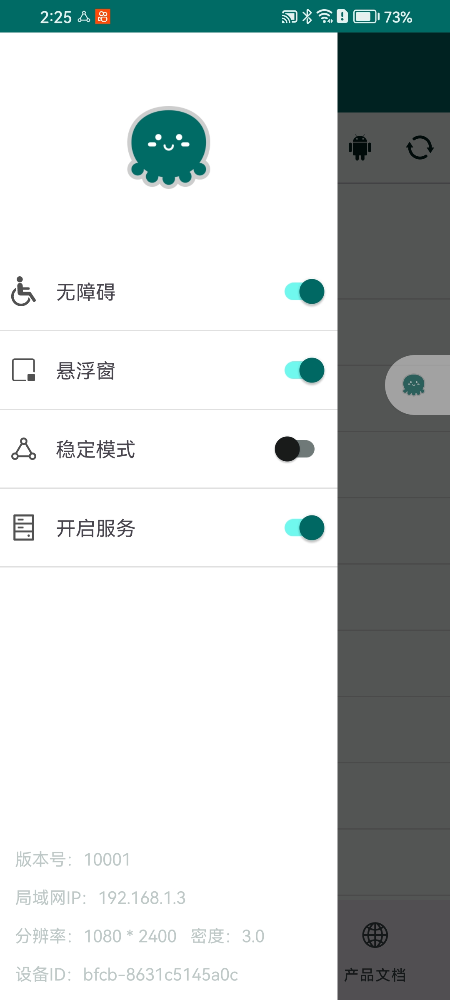
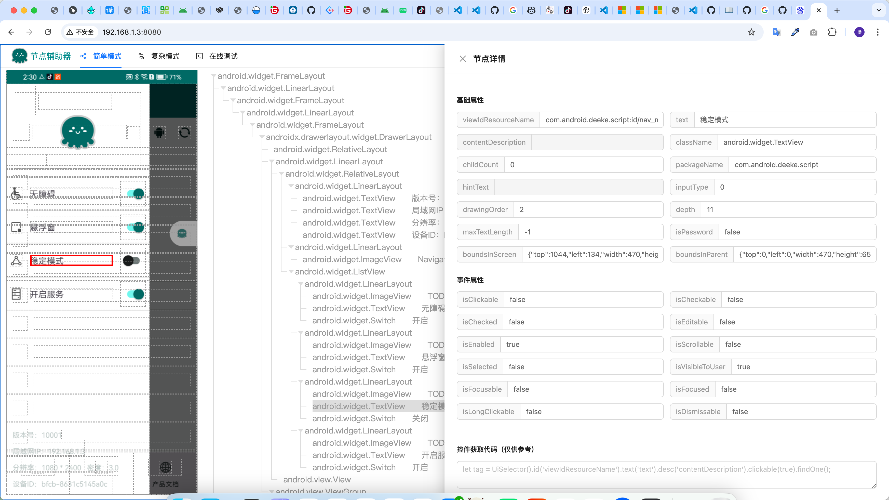
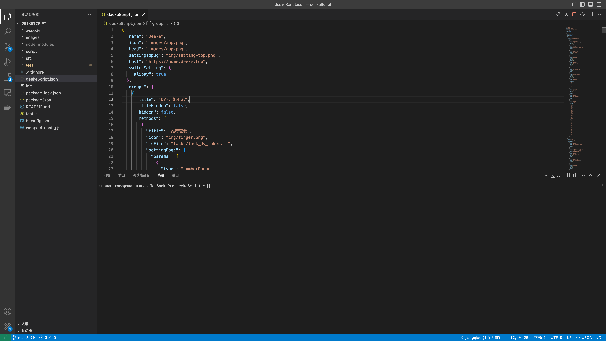
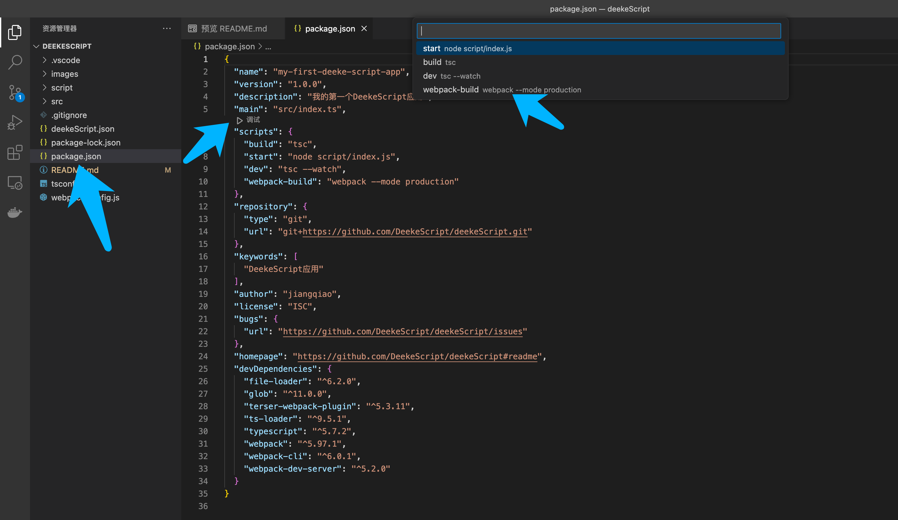

# 快速开始

目前DeekeScript采用JavaScript语言开发。

- 支持DeekeScript代码提示
- 支持JavaScript混淆代码
- 支持模块化、多线程、定时器

> 接下来介绍如何创建项目以及相关准备工作

## 准备工作
* [下载vscode](https://code.visualstudio.com/)
  > 特别说明：vscode请升级到最新版

* 在Vscode中安装DeekeScript开发插件，如下图，点击“安装”即可
 

* 在手机上<a target="_blank" href="../assets/v1.1.07-release.apk">下载安装DeekeScript软件包</a>，或者扫码下载：

   
  
* 打开DeekeScript的侧边栏（左上角“三条杠”），开启“无障碍”、“悬浮窗”、“开启服务”

### 认识节点查看器
> 节点查看器主要用于查看手机界面上的“控件”信息，使用节点信息来查找你需要的“控件”，然后对控件进行点击或者输入以及滑动等操作

- 打开手机端的DeekeScript，如下图，可以看到手机的局域网IP是“192.168.1.3”：

  

- 打开浏览器，输入："http://192.168.1.3:8080"，可以看到下面的页面
  

- 选择左侧的控件，点击之后，就可以清楚地看到控件信息了

> 如果你需要看到更多的控件，可以选择“复杂模式”；有时候你可能不想打开vscode调试，你可以切换到“在线调试”进行功能调试

## 创建JavaScript项目

- 安装nodejs

- 安装git（npm方式拉取，则不需要安装）

- 通过npm拉取代码【推荐方式】
  ```
  # 如果执行下面的代码卡顿，注意将npm镜像设置为阿里云镜像
  npm i deeke-script-app
  ```

- 通过git获取基础代码【和npm方式拉取代码作用一样】
  ```
  git clone https://github.com/DeekeScript/DeekeScript ./
  # 如果执行下面的代码卡顿，注意将npm镜像设置为阿里云镜像
  npm install
  ```

- 打开Vscode代码编辑器，并且将刚刚拉取的项目打开，如下图：


- 编写JavaScript代码

- [混淆代码](../code/encryption.md)【可省略】
  ```
  #在项目根目录下执行如下命令（命令可以查看项目下的package.json文件）
  npm run build
  ```

  
  
- [同步项目到手机](../config/vscode.md)，让APP启动

- 手机中的APP已经出现了相应的界面，可以在手机中点击对应的功能进行运行，大概如下图：

  


## 单个JavaScript调试
> 我不想创建项目，只想创建一个js文件，直接运行可以么？
这样是可以的，目前DeekeScript只支持项目运行，vscode可以调试单个文件，操作如下：

- 创建一个js文件，如：test.js
- 点击右上角的“执行”图标即可
  
> DeekeScript支持单文件调试，并且支持引入模块（需要把相关文件同步到手机），换句话说，可以直接运行你开发的某个功能，而不需要从手机上点击运行具体功能
